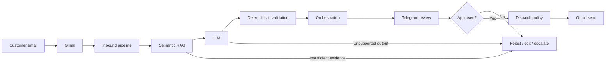

# AI Sales Agent

[](https://github.com/boyarkavolzhentsev/ai-sales-agent/actions/workflows/ci.yml)


A production-oriented, human-in-the-loop AI sales agent for inbound and outbound email workflows.

It combines **Gmail**, **semantic RAG over approved company knowledge**, **OpenAI / Anthropic / Gemini**, **embeddings**, and **Telegram operator approval** while keeping deterministic business rules outside the model.

> **Release status:** `CODE_READY`. The complete fake-provider production pipeline is validated. Real-provider live E2E verification is still pending.

## What it does

- Processes inbound sales email
- Classifies intent and sales context
- Retrieves approved company knowledge with semantic RAG
- Generates grounded sales replies
- Extracts qualification and commercial signals
- Manages leads, opportunities, follow-ups and campaigns
- Escalates unsupported or low-confidence requests
- Sends actions to Telegram for human approval
- Dispatches approved email through Gmail
- Recovers safely from restarts and ambiguous provider outcomes

## End-to-end workflow



No LLM call can directly approve, send, mark a lead won/lost, create DNC state, or bypass dispatch policy.

## Supported providers

| Capability | Providers |
|---|---|
| Email | Gmail |
| Operator | Telegram |
| LLM | OpenAI, Anthropic, Gemini |
| Embeddings | OpenAI, Gemini |
| Knowledge | LOCAL approved knowledge |
| Persistence | SQLite |

LLM and embeddings providers are independent.

## Safety model

The LLM is **not** business authority.

It cannot:
- approve its own reply;
- send email directly;
- mark a lead `WON` or `LOST`;
- approve commercial terms;
- create do-not-contact state;
- bypass quotas, send windows or the kill switch.

If approved knowledge is insufficient, the agent escalates instead of inventing product, pricing, SLA or commercial facts.

## Reliability

Validated scenarios include:
- approval committed → restart → exactly one Gmail send;
- Gmail submission `UNKNOWN` → reconciliation without blind resend;
- transient AI failure → durable retry;
- interrupted embeddings indexing → lease recovery;
- overlapping scheduler runs → one logical outbound result.

## Semantic RAG

```bash
python -m app.runtime knowledge-index
```

The indexer embeds only approved/current knowledge, reuses unchanged vectors, invalidates stale vectors when knowledge/model/provider/dimensions change, and uses durable claims for concurrent indexing.

Production requires semantic retrieval. If the semantic index is incomplete, the system fails closed and escalates.

## Deployment

Production target:
- Python 3.13
- Docker
- SQLite
- one deployment per company
- one-shot scheduler commands

```bash
python -m app.runtime provider-status
python -m app.runtime gmail-auth
python -m app.runtime init
python -m app.runtime knowledge-index
python -m app.runtime deployment-check
```

Optional explicit provider checks:

```bash
python -m app.runtime llm-check
python -m app.runtime embeddings-check
```

See [docs/deployment.md](docs/deployment.md) for the full production runbook.

## Test status

```text
2750 passed
3 skipped
```

Verified on Python 3.13.16 and Python 3.14.

## Repository structure

```text
app/
├── ai/
├── campaign/
├── commercial/
├── conversation/
├── dispatch/
├── embeddings/
├── inbound/
├── integrations/
├── knowledge/
├── llm/
├── operator/
├── orchestration/
├── persistence/
├── pipeline/
└── runtime/

docs/
├── deployment.md
└── integrations.md
```

## Documentation

- [Architecture overview](docs/architecture.md)
- [Deployment runbook](docs/deployment.md)
- [Provider integrations](docs/integrations.md)
- [Knowledge base format](knowledge_base/README.md)
- [Security guidance](SECURITY.md)

## Project status

```text
CODE_READY
LIVE_E2E_NOT_RUN
```

V1 feature development is complete at the code level.

The remaining step before `LIVE_VERIFIED` is a controlled smoke test with real test credentials.
