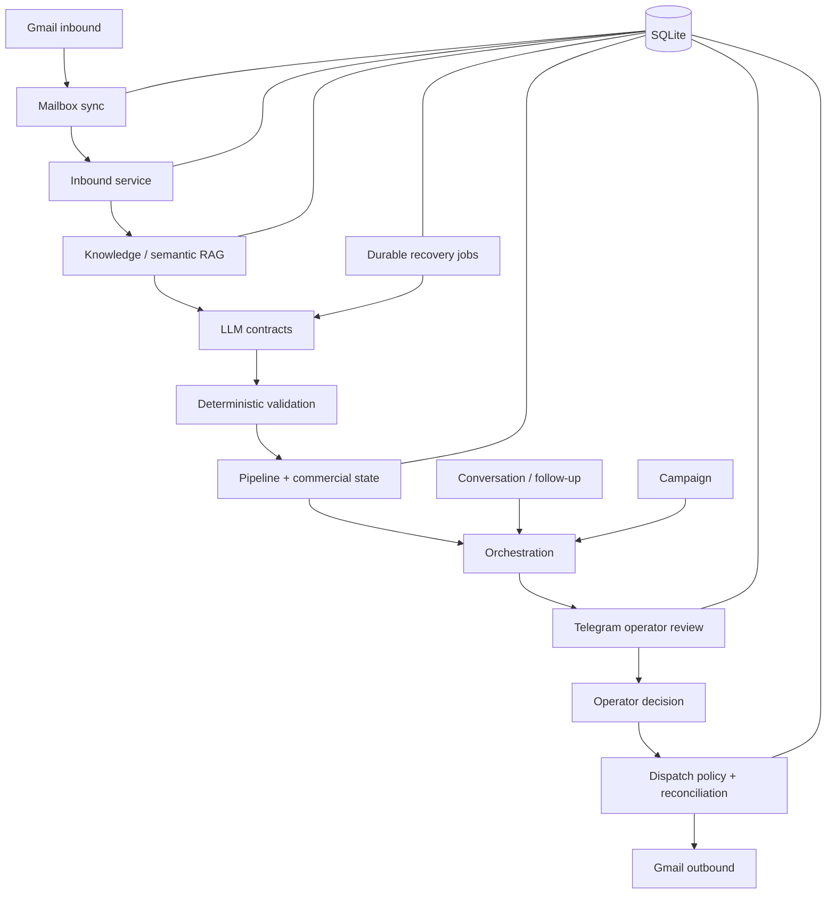

# Architecture

AI Sales Agent is a human-in-the-loop sales automation system built around deterministic business rules, approved company knowledge, durable state and replaceable provider adapters.

## System flow



## Layering

### Provider integrations

External systems are isolated under `app/integrations/`.

Implemented adapters:

- Gmail
- Telegram
- OpenAI LLM
- Anthropic LLM
- Gemini LLM
- OpenAI embeddings
- Gemini embeddings

Provider-specific HTTP/API details do not leak into business packages.

### Provider-neutral contracts

The domain consumes narrow interfaces for email transport, reconciliation, mailbox reading, LLM generation and embeddings.

This keeps provider selection independent from sales logic.

### Knowledge and RAG

The authoritative knowledge source is LOCAL approved knowledge.

Production semantic retrieval:

1. loads only approved/current/external-use knowledge;
2. embeds chunks incrementally;
3. stores normalized vectors durably in SQLite;
4. embeds a bounded customer query;
5. ranks with cosine similarity;
6. applies an explicit relevance threshold;
7. preserves evidence IDs through generation and claim checking.

Similarity alone never makes an answer safe. Existing deterministic knowledge sufficiency rules still decide whether the model may draft.

### LLM boundary

LLM output is always proposal data.

The model cannot directly:

- approve a reply;
- send email;
- change dispatch policy;
- mark a lead won/lost;
- approve commercial terms;
- create DNC state;
- bypass quotas, send windows or the kill switch.

Structured output is validated locally before business services consume it.

### Operator boundary

Telegram is the operator interface.

Only configured private-chat identities may act as operators. Operator decisions are persisted before execution and survive restarts.

### Dispatch boundary

Stage 8 owns outbound safety.

Before send it re-checks policy and durable state. A provider result may be `ACCEPTED`, `NOT_ACCEPTED` or `UNKNOWN`.

`UNKNOWN` is reconciled later and is never treated as permission to blindly resend.

## Persistence

SQLite is the V1 persistence layer.

It stores:

- message/thread state;
- pipeline and commercial state;
- campaign/follow-up state;
- operator commands and notifications;
- quota reservations;
- dispatch attempts and reconciliation state;
- mailbox sync cursors/failures;
- AI enrichment recovery jobs;
- knowledge metadata/facts/chunks;
- embeddings and indexing claims.

Migrations currently reach schema v13.

## Durability model

Important workflows use durable state rather than process-local memory.

Examples:

- Gmail cursor advances only after handling work safely;
- dispatch attempts survive restart;
- operator approvals survive restart;
- AI enrichment jobs use claims, leases and bounded retry;
- semantic indexing uses durable claims;
- stale claims can be reclaimed after lease expiry.

## Runtime model

V1 intentionally uses one-shot commands instead of an always-running daemon.

A scheduler can invoke:

```text
email-sync
ai-recovery-tick
operator-sync
tick
```

or the bounded composite:

```bash
python -m app.runtime service-tick --dispatch-approved
```

The service tick runs:

```text
email-sync
→ ai-recovery
→ operator-sync
→ tick
```

This keeps failure/restart semantics observable and testable.

## Production assumptions

- one deployment per company;
- one Gmail mailbox environment;
- one Telegram operator set;
- one SQLite database on persistent storage;
- semantic embeddings required in production;
- no horizontal scaling of multiple hosts against one local SQLite file;
- no autonomous web research;
- no auto-send without operator approval.

## Recovery scenarios validated by tests

- process restart after inbound handling;
- restart after Telegram approval but before send;
- ambiguous Gmail submission followed by reconciliation;
- transient AI failure followed by recovery;
- interrupted semantic indexing;
- overlapping scheduler passes.

See [deployment.md](deployment.md) for the operational runbook.
